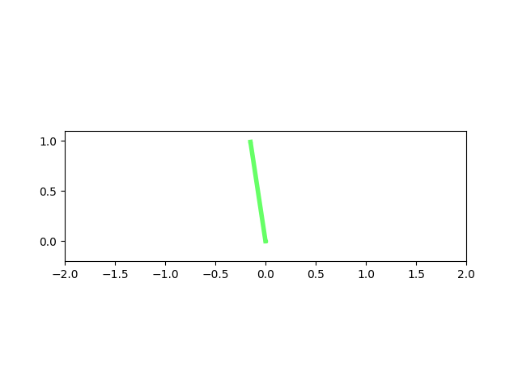

# Inverted_Pendulum_Controller_Simulation
A python simulation of an inverted pendulum. It was modelled using the Lagrangian, put into state space format and linearised using Taylor approximation. PD, full state and LQR controllers were designed and tested on the nonlinear system. Gains were obtained through analytical methods followed by experimental tuning. 
The simulations below show the rections of the pendulum when the pendulum has an error of 10 degrees initially

## Demo
### PD Controller

The drift issue is caused by the error signal being angular error with nothing that takes cart position into account. This could be solved with the introduction of a second controller with an error signal of cart postion, however this would make tuning difficult since equations of motion of the pendulum and the cart are coupled.

### Full State Controller

Since full state computes gains based on all states it creates a repsonse that accounts for both pendulum angle and cart postion, removing the drift issue seen in the PD controller.

### LQR Controller

The cost function is weighted heavily for reduction of angular error, therefore it quickly returns the pendulum to vertical and slowly returns to the centre.
